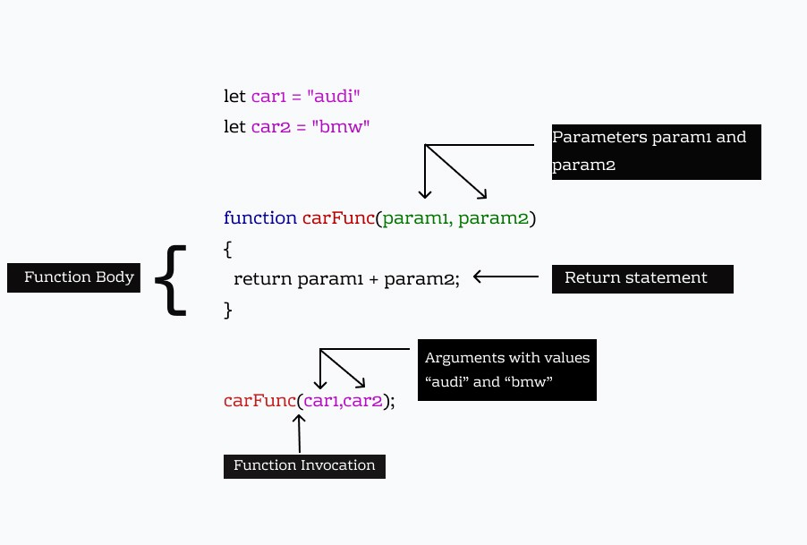

## What is functions?

// function declaration

- In general meaning, a function is piece of code that we can use again n over again.

<h1>Syntax:</h1>

```javascript
function myFunction(){
    --- logic----
}
myFunction();   // call function
```
<h1>Example: </h1>

```javascript
function sayHello(){
    console.log("Hello world!");
}
sayHello();
```





**For better understanding let's understand with another example**

```javascript
function fruitProcessor(apples,oranges){
    console.log(apples,oranges);
    const juice = `Juice with ${apples} apples and ${oranges} oranges`;
    return juice;
}
fruitProcessor(5,0);

const applejuice = fruitProcessor(5,0);
console.log(applejuice);

// apples, oranges are parameter.
// 5,0 are arguments

//output
50
Juice with 5 apples and 0 oranges
```

// function expression


- Function expression means whole function is hold by one variable.

**Example:**

```javascript
const calcAge2 = function(birthYear){
    return 2037 -  birthYear;
}
console.log(calcAge2(1991));
```

<h1>How to call one function under another</h1>

- To call a function inside another function, define the inner function inside the outer function and invoke it. When using the function keyword, the function gets hoisted to the top of the scope and can be called from anywhere inside of the outer function.

**Example:**

```javascript
const cutPieces = function (fruit){
    return fruit * 4;
};
const fruitProcessor = function(apples , oranges){
    const applePieces = cutPieces(apples);
    const orangePieces = cutPieces(oranges);

    const juice = `Juice with ${applePieces} pieces of apples and ${orangePieces} pieces of oranges`;
    return juice;
};

console.log(fruitProcessor(3,4));

//output
Juice with 12 pieces of apples and 16 pieces of oranges
```
